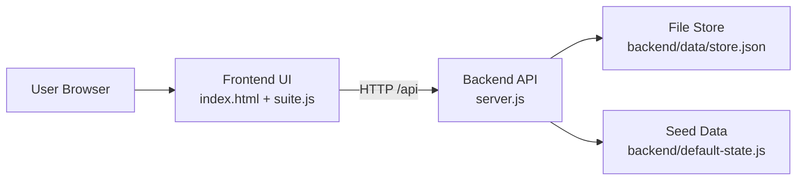

# SoumyaFlow Frontend

Professional task manager frontend for the company workspace. This UI handles dashboards, task boards, attendance views, leave management, admin controls, reports, and notifications.

## Overview

This frontend is designed to work with the sibling backend folder:

- Backend path: `../task-manager-backend`
- Backend base URL: `http://localhost:3000/api`

It does not use browser-only demo storage anymore. All main actions are now sent to the backend API.

## Features

- professional board and backlog
- employee dashboard
- attendance and work log screens
- leave management and holiday calendar
- admin panel and security settings
- notifications and announcements
- report export actions

## Tech Stack

- HTML
- CSS
- Vanilla JavaScript

## Project Structure

```text
task-manager-frontend/
|-- index.html
|-- privacy.html
|-- terms.html
|-- styles.css
|-- enterprise.css
|-- suite.js
|-- .gitignore
`-- README.md
```

## Run

1. Start the backend server from the sibling backend folder.
2. Open the app in the browser at `http://localhost:3000`

## Architecture Diagram



## Main Responsibilities

- `index.html`: application layout
- `styles.css`: base styling
- `enterprise.css`: dashboard and enterprise UI extensions
- `suite.js`: rendering, view switching, forms, API calls, and client-side interaction logic
- `privacy.html`: starter privacy page
- `terms.html`: starter terms page

## Git Notes

- Commit this folder as the frontend application
- Keep API URLs relative so frontend and backend stay easy to deploy together
- Do not commit generated build files if you later add a bundler
